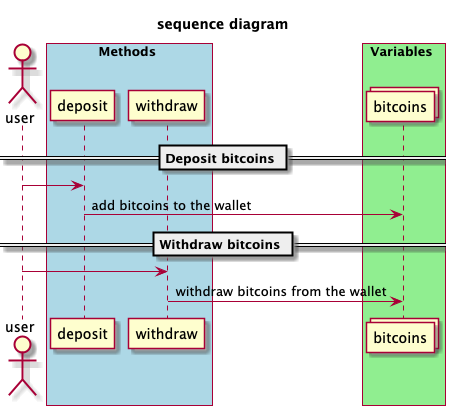
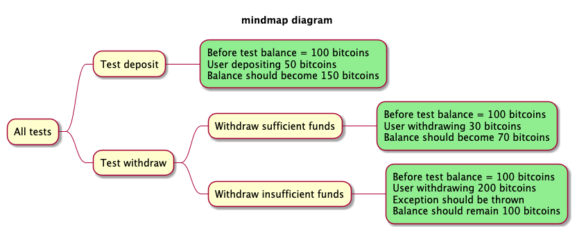

# Homework-1

For this assignment we used JUnit5 and IntelliJ Idea.

## Test suite implemented by Arman

This test suite covers all the tests from the package `kz.edu.nu.arman`

### Wallet of bitcoins
Sequence diagram illustrates a banking system where users can deposit and withdraw bitcoins.

Unit tests should focus on:

1. Deposit Functionality
2. Withdraw Functionality
3. State Consistency: Ensure that after a sequence of deposits and withdrawals, the balance is accurate.

## Test suite implemented by Nurkhan

This test suite covers all the tests from the package `kz.edu.nu.nurkhan`